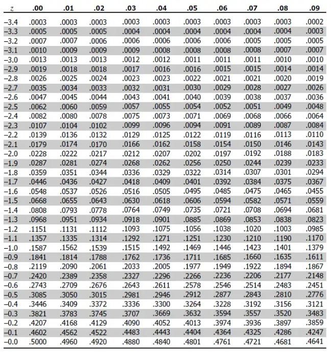

# Week 9 Discussion:

Pick one of the exercises in the readings this week.  Solve the exercise as best as you can.  If you have issues, explicate them, so that all of us can help.

You may use any exercise, even if assigned

**In this course, do not attach files to any of the discussion posts.  Provide your code and commentary plus figures directly in the text box.  Many students don't download files or open other links.**

Reading:

Probability text, Chapters 9 and 10

**Chapter 9.2 Question 3 Page 354**

A piece of rope is made up of 100 strands. Assume that the breaking strength of the rope is the sum of the breaking strengths of the individual strands. Assume further that this sum may be considered to be the sum of a independent trails process with 100 experiments each having expected a value of 10 pounds and standard deviation 1. Find the approximate probability that the rope will support a weight

(a) of 1000 pounds

(b) of 970 pounds

Given:

* Mean =$E(X_i)=10 lbs$
* Standard Deviation = $\sigma(X_i)=1lb$
* Total Strength of rope = $S=X_1+X_2+...+X_{100}$

$\therefore$ Mean of $S$ = $\mu_S=E(S)=100 \times 10 = 1000 lbs$
&
Standard deviation of $S$ is $sigma_S=\sqrt{100} \times 1 = 10 lbs$

So the breaking strength of the rope follows the normal distribution $S$ ~ $N(1000,10^2) \  or \  N(1000,100)$

We can find the Z score or use the pnorm function. I'm just going to do both to compare.

$Z=\frac{X-\mu}{\sigma}$



* $X=1000$, $Z=\frac{1000-1000}{10}=0$, $P(Z \leq 0) \approx 0.5$

* $X = 970$, $Z=\frac{970-1000}{10}=\frac{-30}{10}=-3$, $P(Z\leq -3) \approx 0.0013$

Its also important to understand that, evaluating it this way tells us the likelihood of it breaking, which is intuitively understood, as the lower the weight, the lower the probability according to our results. So to answer the question, we need to subtract 1.

Which means for 1000 lbs the likelihood of the rope supporting the weight is .0 or 50% and for 970 lbs. it is 1-.0013=0.9987 or 99.87%.

**In R**

```{r}
mean_q <-1000
sd_q<- 10

p_1000<-1-pnorm(1000,mean = mean_q, sd=sd_q)

p_970<-1-pnorm(970,mean = mean_q, sd=sd_q)
p_1000
p_970
```

which aligns with the manual computation.
