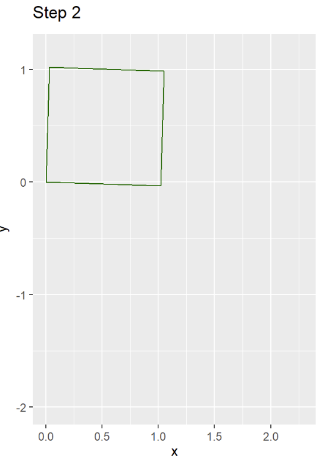
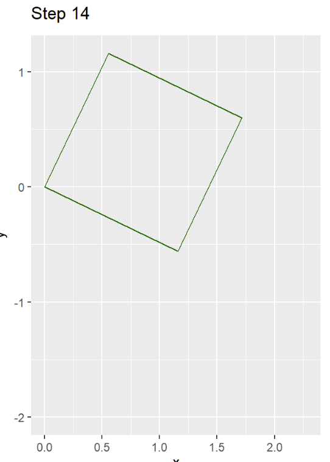

# Instructions

**Submit: In this course, I accept only knitted .pdfs that contain code, figures, and commentary in a professional format.**

## Libraries

```{r, warning=FALSE, message= FALSE}
library("gganimate")
library("ggplot2")
library("gridExtra")
library("imager")
library("jpeg")
library("Matrix")
library("png")
library("pracma")
library("reshape2")
```


## 1.  Geometric Transformation of Shapes Using Matrix Multiplication

**Context:** In computer graphics and data visualization, geometric transformations are fundamental. These transformations, such as translation, scaling, rotation, and reflection, can be applied to shapes to manipulate their appearance.

**Task:** Create a simple shape (like a square or triangle) using point plots in R. Implement R code to apply different transformations (scaling, rotation, reflection) to the shape by left multiplying a transformation matrix by each of the point vectors. Demonstrate these transformations through animated plots.

### i. Create a Shape:

**Define a simple shape (e.g., a square) using a set of point coordinates.**

```{r}
# construct square
square <- matrix(c(0, 0,  
                   1, 0,  
                   1, 1,  
                   0, 1,  
                   0, 0), 
                 ncol = 2, byrow = TRUE)
# Make into a data frame for further use
square_df <- data.frame(x = square[,1], y = square[,2])
```


### ii. Apply Transformations:

* **Scaling:** Enlarge or shrink the shape.

```{r}
# Select factor to scale by
scale_factor<- 4
# copy the original square data frame
square_scaled_df <- square_df
# scale the x value
square_scaled_df$x <- square_df$x*scale_factor
# scale the y value
square_scaled_df$y <- square_df$y*scale_factor
```


* **Rotation:** Rotate the shape by a given angle.

```{r}
# in order to rotate by multiplying x and y by cosine and sine of the rotation
# angle

# obtain rotation angle (45 degree)
theta <- pi/4 
# copy the original square data frame
square_rotate_df <- square_scaled_df
# rotate x
square_rotate_df$x <- square_scaled_df$x * cos(theta) - square_scaled_df$y * sin(theta)
# rotate y
square_rotate_df$y <- square_scaled_df$x * sin(theta) + square_scaled_df$y * cos(theta)
```

* **Reflection:** Reflect the shape across an axis.

```{r}
# reflect by flipping coordinates, in this case x
square_reflected_df <- square_df
square_reflected_df$x <- -square_df$x
```


**Animate Transformations:** Use a loop to incrementally change the transformation matrix and visualize the effect on the shape over time.

```{r}
# Make the square
ani_square <- matrix(c(0, 0, 
                   1, 0, 
                   1, 1, 
                   0, 1, 
                   0, 0), 
                 ncol = 2, byrow = TRUE)

# Make square a data frame
ani_square_df <- data.frame(x = ani_square[,1], y = ani_square[,2])

# Make a sequence of scale factors and angles
ani_scale_factors <- seq(1, 2, length.out = 50)  # Scaling from 1 to 2
ani_angles <- seq(0, pi/2, length.out = 50)  # Rotate from 0 to 90 degrees

# Empty data frame for storing transformation
ani_transformed_frames <- data.frame()

# For Loop to increment through
for (i in 1:length(ani_scale_factors)) {
  # Scale and rotating variables
  ani_scale_factor <- ani_scale_factors[i]
  ani_angle <- ani_angles[i]
  
  # animated scale frames
  ani_scaling_matrix <- matrix(c(ani_scale_factor, 0,
                             0, ani_scale_factor), 
                           nrow = 2)
  
  # animated rotation
  ani_rotation_matrix <- matrix(c(cos(ani_angle), -sin(ani_angle),
                              sin(ani_angle), cos(ani_angle)), 
                            nrow = 2)
  
  # Use %*% for combining
  ani_transformation_matrix <- ani_scaling_matrix %*% ani_rotation_matrix
  
  # Add the transformation to square
  ani_transformed_square <- as.matrix(ani_square_df) %*% t(ani_transformation_matrix)
  
  # Add dataframe to step
  ani_transformed_df <- data.frame(x = ani_transformed_square[,1], y = ani_transformed_square[,2])
  ani_transformed_df$step <- i  # Step number for animation
  ani_transformed_frames <- rbind(ani_transformed_frames, ani_transformed_df)
}

```


### iii. Plot:

**Display the original shape and its transformations in your compiled pdf.  Demonstrate the effect of the transformations with fixed images.**

```{r}
ggplot(square_df, aes(x = x, y = y)) +
  geom_polygon(fill = "lightgreen", color = "darkgreen") +
  coord_fixed() + ggtitle("Square")
```

```{r}
ggplot(square_scaled_df, aes(x = x, y = y)) +
  geom_polygon(fill = "lightgreen", color = "darkgreen") +
  coord_fixed() + ggtitle("Scaled Square")
```

```{r}
ggplot(square_rotate_df, aes(x = x, y = y)) +
  geom_polygon(fill = "lightgreen", color = "darkgreen") +
  coord_fixed() + ggtitle("Rotated Square")
```

```{r}
ggplot(square_reflected_df, aes(x = x, y = y)) +
  geom_polygon(fill = "lightgreen", color = "darkgreen") +
  coord_fixed() + ggtitle("Reflected Square")
```
### iv. Animated Plot:

```{r}
# animate(ggplot(ani_transformed_frames, aes(x = x, y = y, group = step)) +
#   geom_polygon(fill = NA, color = "darkgreen") +
#   coord_fixed() +
#   transition_states(step, transition_length = 2, state_length = 1) +
#   labs(title = 'Step {closest_state}') +
#   ease_aes('linear'))

```





[gganimate package - RDocumentation](https://www.rdocumentation.org/packages/gganimate/versions/1.0.9)
[A Grammar of Animated Graphics](https://gganimate.com/)

```{r}
rm(list = ls(pattern = "^(ani|i|square)"))
```


## 2.  Matrix Properties and Decomposition

### i. Proofs

#### a.

* Prove that $AB\neq BA$


$$
A = \begin{pmatrix}
0 & 1 \\
0 & 0 \\
\end{pmatrix} \ \
B = \begin{pmatrix}
1 & 0 \\
0 & 0 \\
\end{pmatrix}
$$

$$
AB = \begin{pmatrix}
0 & 1 \\
0 & 0 \\
\end{pmatrix}
\begin{pmatrix}
1 & 0 \\
0 & 0 \\
\end{pmatrix}
=
\begin{pmatrix}
0 & 0 \\
0 & 0 \\
\end{pmatrix}
$$

$$
BA = \begin{pmatrix}
1 & 0 \\
0 & 0 \\
\end{pmatrix}
\begin{pmatrix}
0 & 1 \\
0 & 0 \\
\end{pmatrix}
=
\begin{pmatrix}
1 & 0 \\
0 & 0 \\
\end{pmatrix}
$$

$\therefore AB\neq BA$

#### b.

* Prove that $A^t A$ is always symmetric.

**Definition: SYM Symmetric Matrix** (Beezer : A First Course in Linear Algebra: pg. 186) The matrix A is symmetric if $A = A^t$
$\therefore A^t A = (A^t A)^t$

**Theorem: MMT Matrix Multiplication and Transposes:** (Beezer : A First Course in Linear Algebra: pg. 166) $(AB)^t = B^t A^t$
$\therefore (A^t A)^t = (A^t)^t A^t$

**Theorem TT Transpose of a Transpose** (Beezer : A First Course in Linear Algebra: pg. 168) $(A^t)^t=A$
$\therefore  (A^t)^t A^t=A A^t$

Which essentially shows that $A^tA$ is equal to its own transpose.

#### c.

* Prove that the determinant of $A^T A$ is non-negative

* Multiplying the Matrix $A^t A$ results in a square matrix $(n\times m)\times(n\times m)=(n\times n) $
* Above proof shows its always symmetric.
* Symmetric Matrices have real eigen values.
* The determinant of a matrix is the product of its eigenvalues.
* So for any vector $x \in R^n$ if we consider a non zero vector x than $x^t(A^t A)x= (Ax)^t(Ax)=(Ax)(Ax)=||Ax^2||$
* $||Ax^2||$ represents the square of Euclidean norm (length) of vector $Ax$, which is always non-negative.
* With $A^tA$ positive semi-definite, its implied so are the eigen values since $\lambda \ of A^t A$ has to satisfy $x^t(A^t A)x = \lambda x^r x$
* Given
  - $x^t(A^t A)x = ||A^t|| \geq 0$
  - $x^t x$ (norm of x square) is $\lambda$
  - scales $x^tx$

$\therefore$ the equation must be non-negative as well.

### i. Singular Value Decomposition (SVD) and Image Compression

**Context:**  Every time you upload a photo to social media, algorithms often compress your image to reduce file size without significantly degrading quality. One of the key techniques used in this process is Singular Value Decomposition (SVD), which is another form of matrix factorization.

**Task:**  Write an R function that performs Singular Value Decomposition (SVD) on a grayscale image (which can be represented as a matrix). Use this decomposition to compress the image by keeping only the top k singular values and their corresponding vectors. Demonstrate the effect of different values of k on the compressed image's quality. You can choose any open-access grayscale image that is appropriate for a professional program.  

**Instructions:**

* **Read an Image:** Convert a grayscale image into a matrix.

```{r}
img <- load.image("GrayScaleIMG.jpg")
gray <- grayscale(img)
gray_matrix <- as.matrix(gray)

# Print the dimensions to confirm it's a matrix
print(dim(gray_matrix))
```

```{r}
plot(gray, main = "Grayscale Image")
```


* **Perform SVD:** Factorize the image matrix $A$ into $U \sum V^T$ using R's built-in svd() function.

```{r}
gray_svd <- svd(gray_matrix)
gray_U<- gray_svd$u
gray_Sigma<- gray_svd$d
gray_Vt<- t(gray_svd$v)
```

* **Compress the Image:** Reconstruct the image using only the top k singular values and vectors.

```{r}
gray_reconstruct <- function(U,Sigma,Vt,k){
  U_k <- U[,1:k]
  Sigma_k <- diag(Sigma[1:k])
  Vt_k <- Vt[,1:k]
  
  img_reconstructed <- U_k %*% Sigma_k %*% t(Vt_k)
  
  return(img_reconstructed)
}
```


```{r}
# gray_reconstruct(gray_U, gray_Sigma, gray_Vt, k)
```


* **Visualize the Result:** Plot the original image alongside the compressed versions for various values of k (e.g., k = 5, 20, 50).

```{r}

k_values <- c(5, 20, 50)  # Values of k for compression

# Set up plotting area
par(mfrow = c(1, length(k_values) + 1)) # Arrange plots

# Visualize the original image
image(gray_matrix, col=gray.colors(256),  main = "Original Image", axes = FALSE)

# Visualize reconstructed images for different k values
for (k in k_values) {
  img_reconstructed <- gray_reconstruct(gray_U, gray_Sigma, gray_Vt, k)
    # Ensure the image matrix is properly scaled and in the correct range
  img_reconstructed <- pmax(pmin(img_reconstructed, 1), 0)  # Clip values to [0, 1] range
  
  # Plot the reconstructed image
  image(img_reconstructed, col=gray.colors(256), main = paste("Reconstructed k =", k), axes = FALSE)
}
```

```{r}
rm(list = ls())
```


## 3. Matrix Rank, Properties, and Eigenspace

### i. Determine the Rank of the Given Matrix:

Find the rank of the matrix $A$. Explain what the rank tells us about the linear independence of the rows and columns of matrix $A$. Identify if there are any linear dependencies among the rows or columns.

$$
A = \begin{pmatrix}
1 & 4 & 1 & 3\\
-2 & -3 & 4 & 1 \\
5 & 6 & 2 & 8 \\
-1 & -2 & 3 & 7\\
\end{pmatrix}
$$

```{r}
rank_matrix <- matrix(c(1, 4, 1, 3, -2, -3, 4, 1, 5, 6, 2, 8, -1, -2, 3, 7), nrow = 4, byrow = TRUE)
print(rank_matrix)
```

The reduce row echelon form of this matrix is

```{r}
rank_matrix_echelon<-rref(rank_matrix)
print(rank_matrix_echelon)
```

```{r}
qr(rank_matrix)[2]
```

Rank is the # of linearly independent rows or columns of a matrix.
Matrix A has a rank of 4, meaning all rows and columns are linearly independent. 
For rows and columns there are no linear dependencies. 
$\therefore$ No row or column can be written as a linear combination of another row/column.

### ii. Matrix Rank Boundaries:

#### a.

* Given an $m\times n$ matrix where $m > n$, determine the maximum and minimum possible rank, assuming that the matrix is non-zero.

Assumption:

$$
A \neq \begin{pmatrix}
0 & 0 & 0 \\
0 & 0 & 0  \\
0 & 0 & 0 \\
0 & 0 & 0\\
\end{pmatrix}
$$

Given our assumption the Minimum for the matrix is 1 by exclusion.
The maximum Rank is the smaller of $m \ \& \ n$ (row and columns) $\therefore$.
Since it is stated that $m > n$ the maximum rank is $n$.
$\therefore$ the the rank lies between $1$ and $n$, inclusively.

#### b.

* Prove that the rank of a matrix equals the dimension of its row space (or column space). Provide an example to illustrate the concept.

Row Rank of Matrix: Max # of linearly independent Rows.
Column Rank of Matrix: Max # of linearly independent Column
Row Space of a Matrix: Vector space spanned by its row.
Column Space of a Matrix:  Vector space spanned by its column
Dimensions of Vector Space: # of Vectors in a basis for a space (i.e. 3 of linearly independent vectors in a space).

Proof Strategy: Show Rank is equal to the dimension of both row space and column space. 

Step 1: Create a Matrix of Rank 1

```{r}
Proof_Matrix <- matrix(c(1, 2, 3, 4, 2, 4, 6, 8, 3, 6, 9, 12), nrow = 3, ncol = 4, byrow = TRUE)

Proof_Matrix
```

```{r}
Proof_rank <- qr(Proof_Matrix)$rank
Proof_rank
```

Step 2:
Show that the Row and column Space dimensions is 1, b/c Row and Columns are linearly dependent. 

```{r}
# Find row space (basis of row vectors) using singular value decomposition (SVD)
svd_A <- svd(Proof_Matrix)
row_space_basis <- svd_A$u[, 1:Proof_rank]
print("Row space basis vectors:")
print(row_space_basis)

# Find column space (basis of column vectors)
column_space_basis <- svd_A$v[, 1:Proof_rank]
print("Column space basis vectors:")
print(column_space_basis)
```

This proves *that the rank of a matrix equals the dimension of its row space (or column space)*. 

### iii. Rank and Row Reduction:

* Determine the rank of matrix $B$. Perform a row reduction on matrix $B$ and describe how it helps in finding the rank. Discuss any special properties of matrix $B$ (e.g., is it a rank-deficient matrix?).
 
$$
B = \begin{pmatrix}
2 & 5 & 7\\
4 & 10 & 14 \\
1 & 2.5 & 3.5 \\
\end{pmatrix}
$$

```{r}
B<-matrix(c(2, 5, 7, 4, 10, 14, 1, 2.5, 3.5), nrow = 3, byrow = TRUE)
```

The rank of B is 

```{r}
B_rank<-qr(B)$rank
print(B_rank)
```


```{r}
rref_B<-rref(B)
print(rref_B)
```


Rank is 1 the only non-zero row. Row reduction helps illustrate how $Rank > Number \ of \ Rows$ making it "rank deficient" and showing it has linear dependencies. Essentially because they are linearly dependent, there are not 3 vectors but 1 with a unique direction. The second and third columns are just scalar multiples of the first.


### iv. Compute the Eigenvalues and Eigenvectors:

Find the eigenvalues and eigenvectors of the matrix $A$.  Write out the characteristic polynomial and show your solution step by step. After finding the eigenvalues and eigenvectors, verify that the eigenvectors are linearly independent. If they are not, explain why.

$$
A =  \begin{pmatrix}
3 & 1 & 2\\
0 & 5 & 4 \\
0 & 0 & 2 \\
\end{pmatrix}
$$

For eigenvalues and characteristic polynomials use

$$
det(A - \lambda I) = \left| \begin{matrix}
3- \lambda & 1 & 2\\
0 & 5- \lambda & 4 \\
0 & 0 & 2- \lambda \\
\end{matrix} \right|
$$

Characteristic plynomial is:
$det(A- \lambda I)=0 \rightarrow (3- \lambda) (5- \lambda) (2- \lambda)=0$
Therefore
$\lambda^3 - 10 \lambda^2 +31 \lambda - 30 = 0$
The eigen values are $\lambda_1=3 , \lambda_2=5 , \lambda_3=2$ respectively

```{r}
A<-matrix(c(3,1,2,0,5,4,0,0,2), nrow = 3, byrow = TRUE)
print(A)
```

The eigenvectors are:

```{r}
Eigen_matrix<-eigen(A)$vector
print(Eigen_matrix)
```

if the eigen vectors are linearly independent the determinant of the Eigen_matrix will be a non-zero.

```{r}
det_Eigen_matrix <-det(Eigen_matrix)
```

```{r}
cat("Determinant of the matrix of eigenvectors:\n")
print(det_Eigen_matrix)

# Check if the eigenvectors are linearly independent
if (det_Eigen_matrix != 0) {
  cat("The eigenvectors are linearly independent.\n")
} else {
  cat("The eigenvectors are NOT linearly independent.\n")
}
```


### v. Diagonalization of Matrix:

* Determine if matrix $A$ can be diagonalized. If it can, find the diagonal matrix and the matrix of eigenvectors that diagonalizes $A$.

I matrix $A$ can be diagnolized, then the Eigen_matrix $P$ times the Diagonal matrix of eigenvalues time the inverse of $P$ should equal to $A$

```{r}
P<-Eigen_matrix
D<-diag(eigen(A)$values)
P_inv<-solve(P)
A_diag<- P %*% D %*% P_inv
```

```{r}
cat("Matrix P (eigenvectors):\n")
print(P)

cat("Diagonal matrix D (eigenvalues):\n")
print(D)

cat("Matrix P inverse (eigenvectors inverse):\n")
print(P_inv)

cat("Matrix A reconstructed from P, D, and P^-1:\n")
print(A_diag)
```

So A can be diagonalize with matrices noted above

4.  **Project: Eigenfaces from the LFW (Labeled Faces in the Wild) Dataset**

**Context:** Eigenfaces are a popular application of Principal Component Analysis (PCA) in computer vision. They are used for face recognition by finding the principal components (eigenvectors) of the covariance matrix of a set of facial images. These principal components represent the "eigenfaces" that can be combined to approximate any face in the dataset.

**Task:** Using the LFW (Labeled Faces in the Wild) dataset, build and visualize eigenfaces that account for 80% of the variability in the dataset. The LFW dataset is a well-known dataset containing thousands of labeled facial images, available for academic research.

**Instructions:**

1. **Download the LFW Dataset:**

+ The dataset can be accessed and downloaded using the *lfw* module from the *sklearn* library in Python or by manually downloading it from the LFW website.
+ In this case, we'll use the lfw module from Python's sklearn library.

2. **Preprocess the Images:**

+ Convert the images to grayscale and resize them to a smaller size (e.g., 64x64) to reduce computational + complexity.
+ Flatten each image into a vector.

3. **Apply PCA:**

+ Compute the PCA on the flattened images.
+ Determine the number of principal components required to account for 80% of the variability.

4. **Visualize Eigenfaces:**

+ Visualize the first few eigenfaces (principal components) and discuss their significance.
+ Reconstruct some images using the computed eigenfaces and compare them with the original images.

**Provide knitted R or Python code.  ONLY Knitted PDF files are acceptable for submission in this course.  All text, graphics, proofs, and content must be in a professional document that addresses all requirements. **